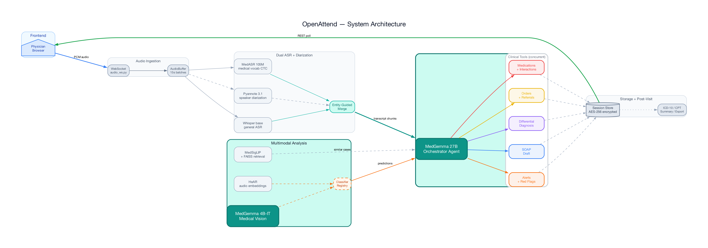
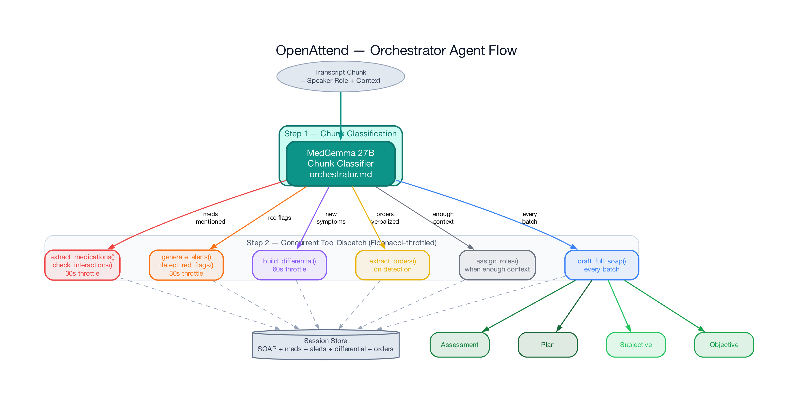
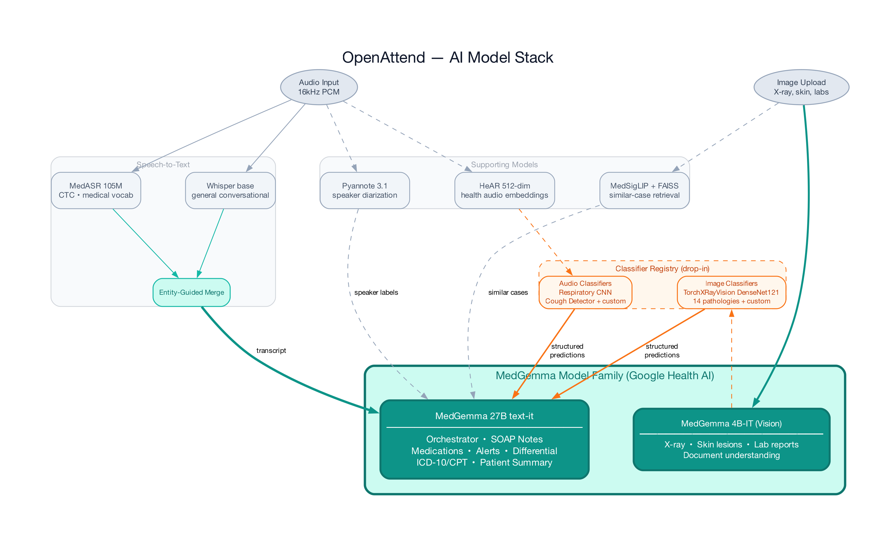
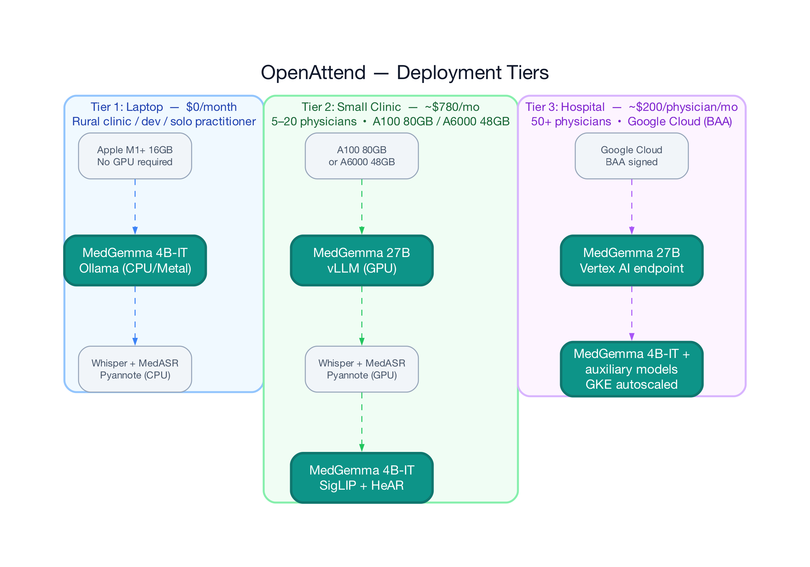
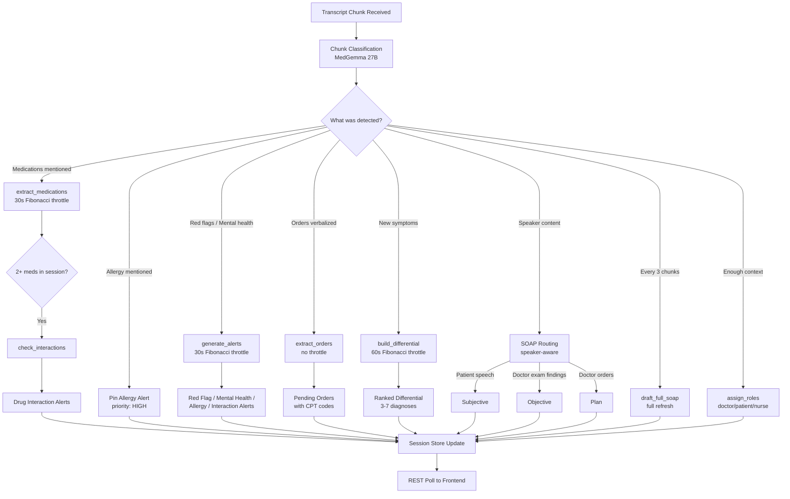

# Open Attend — Architecture Diagrams

Generated by `docs/generate_diagrams.py` using the [Diagrams](https://diagrams.mingrammer.com/) library.

```bash
pip install diagrams && brew install graphviz
python docs/generate_diagrams.py
```

---

## System Overview

End-to-end data flow: microphone → dual ASR → orchestrator → tools → session → frontend.



---

## Orchestrator Agent Flow

The orchestrator classifies each transcript chunk, then concurrently dispatches to specialized tools based on clinical content. Each tool has independent Fibonacci-increasing throttle intervals.



---

## HAI-DEF Model Stack

All models with data flow between them. The classifier registry (dashed orange border) is drop-in ready for any trained audio or image classifier.



---

## Deployment Tiers

Three deployment paths, each with its own script. Same codebase, different infrastructure.



---

## Agent Prompt Registry

All LLM prompts live in `backend/agents/*.md` as structured markdown files, loaded at startup by `agents/__init__.py`. Each `# PROMPT_NAME` header becomes a module-level constant.

| File | Prompts | Purpose |
|------|---------|---------|
| `orchestrator.md` | `ORCHESTRATOR_SYSTEM_PROMPT`, `CHUNK_ANALYSIS_PROMPT_TEMPLATE` | Chunk classification + routing |
| `medications.md` | `MEDICATION_EXTRACTION_PROMPT`, `INTERACTION_CHECK_PROMPT` | Drug extraction + interaction detection |
| `alerts.md` | `ALERT_AGENT_PROMPT`, `RED_FLAG_PROMPT`, `MENTAL_HEALTH_PROMPT`, `LAB_ALERT_PROMPT` | Consolidated clinical alerts |
| `diagnosis.md` | `DIFFERENTIAL_PROMPT` | Ranked differential (3-7 diagnoses) |
| `soap.md` | `SOAP_DRAFT_PROMPT`, `FULL_TRANSCRIPT_SOAP_PROMPT`, `TRANSCRIPT_SECTION_PROMPT`, `SOAP_VERIFICATION_PROMPT` | SOAP drafting + anti-hallucination verification |
| `orders.md` | `ORDER_EXTRACTION_PROMPT`, `FOLLOWUP_EXTRACTION_PROMPT` | Lab/imaging/referral extraction |
| `coding.md` | `ICD10_EXTRACTION_PROMPT`, `CPT_EXTRACTION_PROMPT` | Medical billing codes |
| `speaker.md` | `SPEAKER_ROLE_ASSIGNMENT_PROMPT` | Doctor/patient/nurse role inference |
| `imaging.md` | `IMAGE_ANALYSIS_PROMPT` | Medical image analysis (radiology) |
| `labs.md` | `LAB_EXTRACTION_PROMPT` | Lab report value extraction (vision) |
| `patient.md` | `PATIENT_SUMMARY_PROMPT` | Plain-language summary (6th grade) |
| `eval.md` | `LLM_JUDGE_PROMPT`, `ENTITY_EXTRACTION_PROMPT` | Evaluation pipeline scoring |

---

## Orchestrator Decision Flow (Mermaid)

For GitHub rendering — same flow as the diagram above, in text form:


